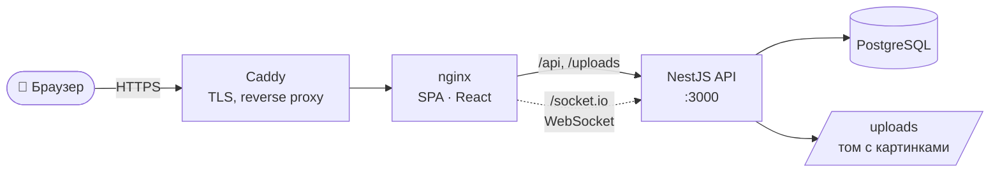

<div align="center">

# 🐾 Pets Store

**Маркетплейс домашних животных** — каталог, корзина и заказы с доставкой, магазины продавцов,
модерация объявлений и чат поддержки в реальном времени.


<br>


[Возможности](#-возможности) •
[Быстрый старт](#-быстрый-старт) •
[Окружение](#-переменные-окружения) •
[Команды](#-команды) •
[Структура](#-структура-репозитория) •
[Документация](#-документация)

</div>

---

## ✨ Возможности

| Роль | Что умеет |
| --- | --- |
| 🛒 **Покупатель** | Каталог с фильтрами и галереей фото, избранное, корзина, оформление заказа с адресом и способом оплаты, история покупок, чат с продавцом и поддержкой |
| 🏪 **Продавец** | Кабинет продавца (переключение buyer ↔ seller без перелогина), свои товары и остатки, история продаж и прибыль, уведомления о новых заказах |
| 🛡️ **Модератор** | Одобрение / отклонение объявлений, предложенные категории, ответы в чатах поддержки |
| 🚚 **Курьер** | Страница доставки: заказы в доставке, фильтр по статусу, отметка «доставлено» |
| 👑 **Администратор** | Управление модераторами, курьерами и магазинами, собственные товары без комиссии |

**Под капотом:**

- 🔐 JWT-аутентификация, ролевой доступ (`admin` · `moderator` · `seller` · `buyer` · `courier`), восстановление пароля
- 💬 Чат в реальном времени на **Socket.IO** — вложения, счётчики непрочитанных, бейдж в шапке
- 🔔 Лента уведомлений с «колокольчиком»
- 💰 Автоматическая комиссия площадки 5 % на товары продавцов
- 📑 Swagger-документация API на `/docs`
- 🗄️ Схема БД под контролем миграций TypeORM
- ✅ Unit-тесты (Vitest, Jest) и e2e-тесты (Cypress)

---

## 🏗 Архитектура



Всё отдаётся с одного origin, поэтому CORS не нужен: nginx раздаёт собранный SPA и проксирует
`/api`, `/uploads` и `/socket.io` на бэкенд.

---

## 🚀 Быстрый старт

### Вариант 1 — Docker Compose (весь стек одной командой)

> Нужны **Docker** и **Docker Compose v2**.

```bash
git clone https://github.com/Benopa/pets-store.git
cd pets-store

./deploy.sh          # первый запуск создаст .env из .env.deploy.example и остановится
nano .env            # задай JWT_SECRET, ADMIN_PASSWORD, DB_PASSWORD
./deploy.sh          # собрать и поднять db + api + web
```

База при первом старте заливается дампом `db/init/01-petstore-dump.sql` — сразу с тестовыми данными.
Подробности про сервер, домен и HTTPS — в [DEPLOY.md](DEPLOY.md).

### Вариант 2 — локальная разработка

> Нужны **Node.js 20+** и **PostgreSQL 13+**.

**1. База данных**

```sql
CREATE USER app WITH PASSWORD 'app';
CREATE DATABASE petstore OWNER app;
```

**2. Бэкенд** → http://localhost:3000 (Swagger — http://localhost:3000/docs)

```bash
cd api-swagger
npm install
cp .env.example .env     # PowerShell: Copy-Item .env.example .env
# впиши в .env свои DB_USERNAME / DB_PASSWORD / JWT_SECRET / ADMIN_PASSWORD
npm run start:dev
```

При старте автоматически применяются миграции и создаётся администратор из `ADMIN_EMAIL` / `ADMIN_PASSWORD`.

**3. Фронтенд** → http://localhost:5173

```bash
cd pets-store-web
npm install
npm run dev
```

Vite проксирует `/api` и `/socket.io` на `localhost:3000`, так что ничего дополнительно настраивать не нужно.

> 💡 Пошаговая инструкция для Windows без Docker — [api-swagger/WINDOWS_SETUP.md](api-swagger/WINDOWS_SETUP.md).

---

## 🔧 Переменные окружения

Реальные `.env` в git не попадают — в репозитории лежат только примеры:

| Файл | Для чего |
| --- | --- |
| [`api-swagger/.env.example`](api-swagger/.env.example) | локальный запуск бэкенда |
| [`.env.deploy.example`](.env.deploy.example) | прод-стек `docker-compose` |

| Переменная | Описание |
| --- | --- |
| `DB_HOST` · `DB_PORT` | адрес PostgreSQL (по умолчанию `localhost:5432`) |
| `DB_USERNAME` · `DB_PASSWORD` · `DB_NAME` | учётка и имя базы |
| `DB_SYNCHRONIZE` | `false` — схемой управляют миграции (рекомендуется), `true` — авто-sync |
| `JWT_SECRET` | секрет подписи JWT — **обязательно смени** |
| `ADMIN_EMAIL` · `ADMIN_PASSWORD` | администратор, создаётся при старте |
| `UPLOAD_DIR` | каталог загрузок: `./uploads` локально, `/app/uploads` в Docker |
| `FRONTEND_URL` | адрес фронтенда для ссылки восстановления пароля |
| `WEB_PORT` | *(только compose)* внешний порт сайта |
| `VITE_API_ORIGIN` | *(фронтенд, опционально)* origin бэкенда для картинок, по умолчанию `http://localhost:3000` |

---

## 📜 Команды

<table>
<tr><th>🎨 Фронтенд — <code>pets-store-web/</code></th><th>⚙️ Бэкенд — <code>api-swagger/</code></th></tr>
<tr valign="top"><td>

| Команда | Действие |
| --- | --- |
| `npm run dev` | dev-сервер Vite |
| `npm run build` | прод-сборка в `dist/` |
| `npm run preview` | просмотр сборки |
| `npm test` | unit-тесты (Vitest) |
| `npm run cypress:run` | e2e-тесты (Cypress) |
| `npm run lint` | ESLint |
| `npm run format` | Prettier |

</td><td>

| Команда | Действие |
| --- | --- |
| `npm run start:dev` | dev с авто-перезапуском |
| `npm run build` | сборка в `dist/` |
| `npm run start:prod` | запуск сборки |
| `npm test` | unit-тесты (Jest) |
| `npm run migration:run` | применить миграции |
| `npm run migration:revert` | откатить последнюю |
| `npm run migration:generate -- src/migrations/Name` | сгенерировать миграцию |

</td></tr>
</table>

**Деплой** (из корня):

```bash
./deploy.sh            # собрать и поднять
./deploy.sh --rebuild  # пересобрать без кэша
./deploy.sh --logs     # логи всех сервисов
./deploy.sh --down     # остановить (данные в томах сохраняются)
```

> Cypress-тесты требуют запущенного стека: фронтенд на `:5173`, бэкенд на `:3000` и PostgreSQL.

---

## 📁 Структура репозитория

```
pets-store/
├── api-swagger/            # ⚙️ Бэкенд: NestJS + TypeORM + PostgreSQL
│   ├── src/
│   │   ├── auth/           #    регистрация, логин, профиль, JWT
│   │   ├── animals/        #    товары, фото, модерация
│   │   ├── orders/         #    заказы и доставка
│   │   ├── shops/          #    магазины
│   │   ├── chat/           #    REST + Socket.IO gateway
│   │   ├── notifications/  #    уведомления
│   │   ├── entities/       #    все TypeORM-сущности
│   │   └── migrations/     #    миграции схемы
│   └── uploads/            #    стартовые картинки товаров
├── pets-store-web/         # 🎨 Фронтенд: React + Vite, Feature-Sliced Design
│   ├── src/
│   │   ├── app/            #    роутинг, store, глобальные стили
│   │   ├── pages/          #    страницы
│   │   ├── widgets/        #    шапка
│   │   ├── entities/       #    слайсы Redux + UI сущностей
│   │   └── shared/         #    api, config, lib
│   └── cypress/            #    e2e-тесты
├── db/init/                # 🗄️ SQL-дамп для первичной инициализации БД
├── docs/                   # 📐 HTML-макеты дизайна
├── docker-compose.yml      # 🐳 прод-стек: db + api + web + caddy
├── Caddyfile               #    HTTPS и reverse proxy
├── deploy.sh               #    скрипт деплоя
└── DEPLOY.md               #    инструкция по деплою
```

---

## 📚 Документация

| Документ | О чём |
| --- | --- |
| [DEPLOY.md](DEPLOY.md) | деплой на сервер, данные, обновление дампа |
| [api-swagger/CLAUDE.md](api-swagger/CLAUDE.md) | устройство бэкенда: модель данных, авторизация, миграции |
| [api-swagger/WINDOWS_SETUP.md](api-swagger/WINDOWS_SETUP.md) | запуск бэкенда на Windows без Docker |
| [pets-store-web/CLAUDE.md](pets-store-web/CLAUDE.md) | устройство фронтенда: FSD, стейт, роутинг, стили |
| [docs/](docs/) | standalone HTML-макеты: магазин и чат поддержки (открываются в браузере) |
| `/docs` на запущенном API | интерактивный Swagger |

---

<div align="center">

Сделано с 💜 и любовью к животным

</div>
